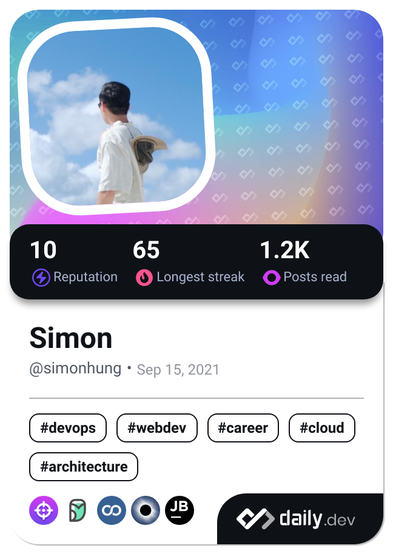

> Drinking coffee, coding, and overcoming boredom.

My name is **Hung Yi-Hsuan**, you can call me **Simon**, and I am a software developer from Taiwan.

- 👨🏻‍💻 I build web apps.
- 📚 I'm currently learning distributed system and web assembly.
- 📝 I share knowledge through my [blog](https://simonhung.notion.site/Spaceman-821091ff754d4b28bfded7bbdfcfb596).
- 💡 I share algorithms on [LeetCode](https://leetcode.com/yihsuanhung/).
- 💜 I listen to podcasts more than music.

## My Tech Stack ✨

<!--
- Building web apps? React + TypeScript
- How about the server? Go
- Leetcode? Python
-->

## My Blog 📖

Read my blog at [Medium](https://yihsuanhung-dev.medium.com/), or my learning notes at [Notion](https://simonhung.notion.site/Spaceman-821091ff754d4b28bfded7bbdfcfb596).

## My dev card 👀
This card shows my interest and articles I read on [daily.dev](https://daily.dev/).

<!--
Legacy DevCard

-->
<!--
## LeetCode 👨🏻‍💻

-->

<!--
**yihsuanhung/yihsuanhung** is a ✨ _special_ ✨ repository because its `README.md` (this file) appears on your GitHub profile.

Here are some ideas to get you started:

- 🔭 I’m currently working on ...
- 🌱 I’m currently learning ...
- 👯 I’m looking to collaborate on ...
- 🤔 I’m looking for help with ...
- 💬 Ask me about ...
- 📫 How to reach me: ...
- 😄 Pronouns: ...
- ⚡ Fun fact: ...
-->
